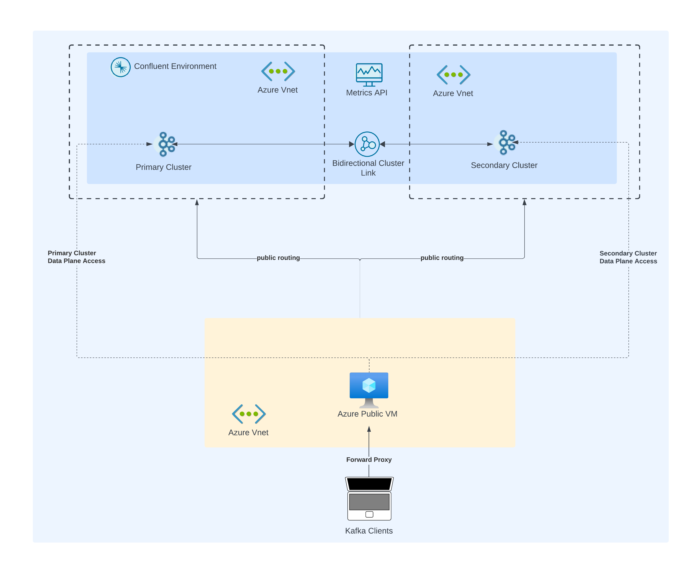
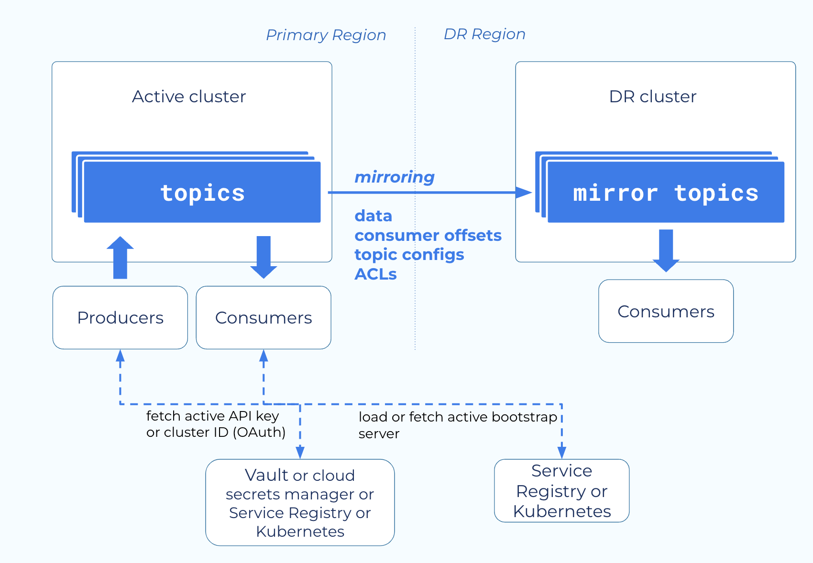
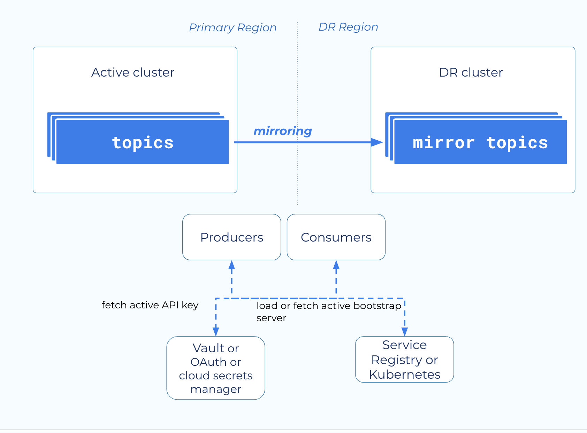
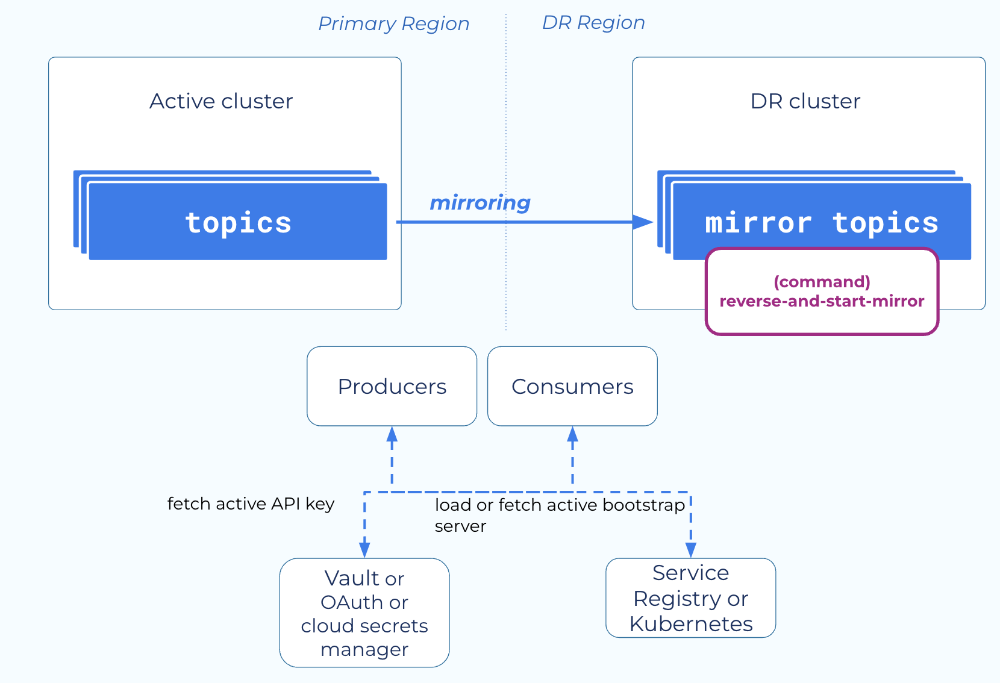
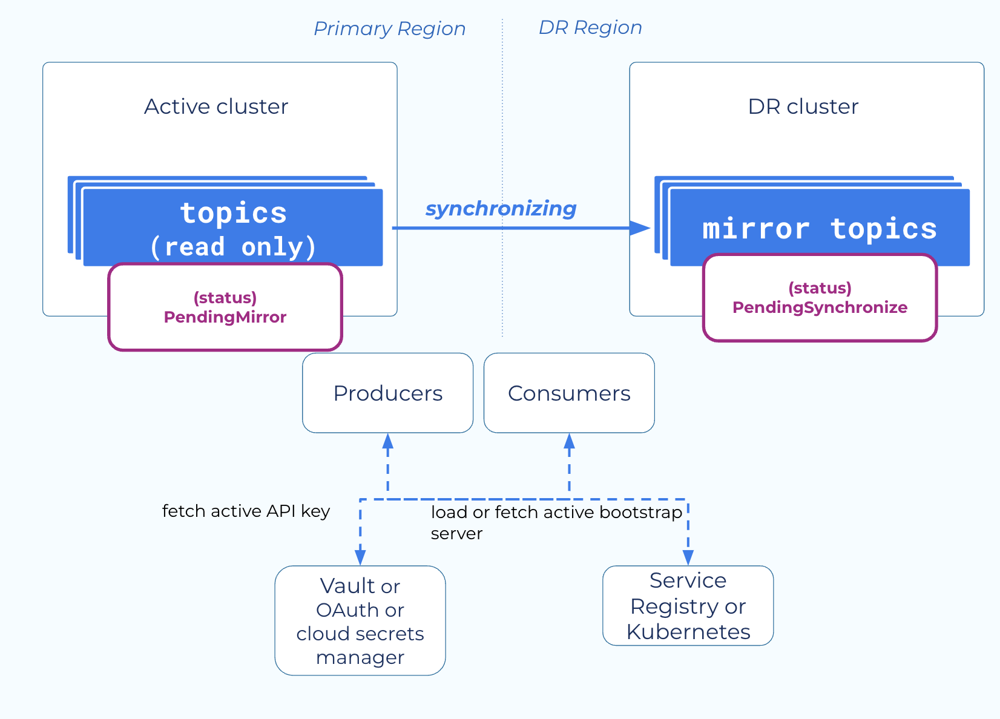
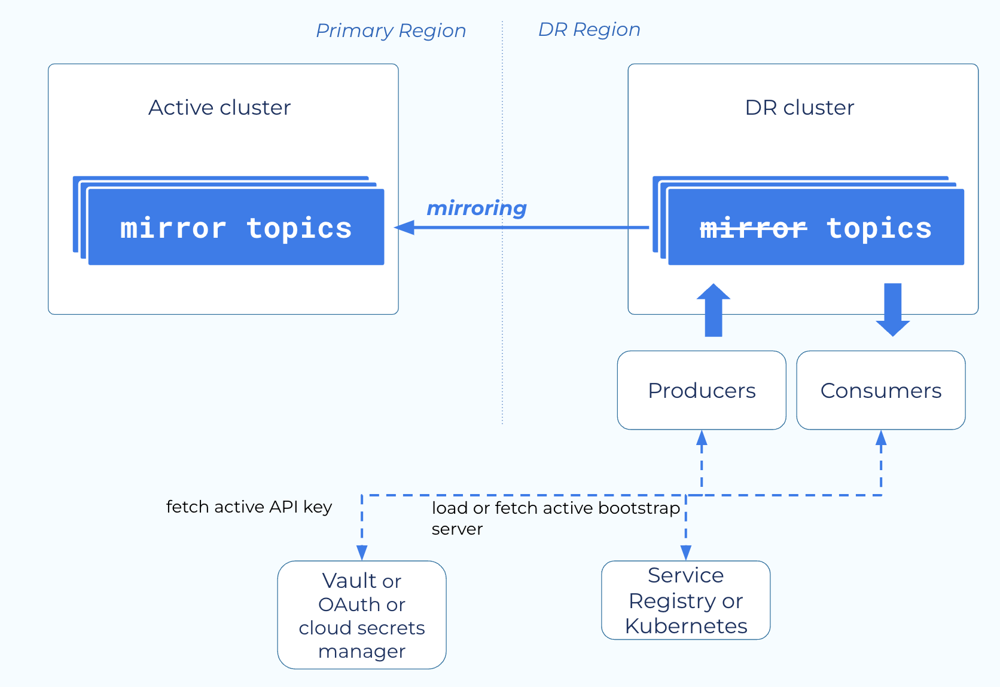
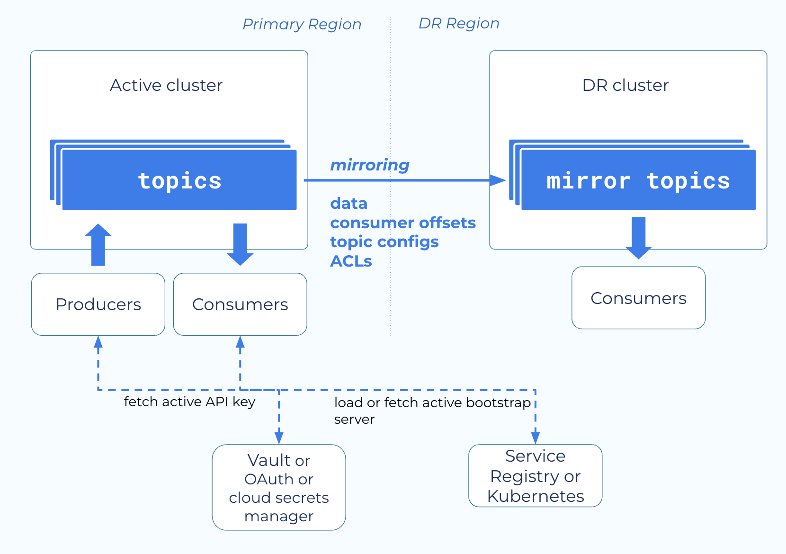

## Active Passive Bidirectional Cluster Linking Dry Run

### Pre-requisite 
#### 1. Azure Subscription, Tenant ID, Azure Client ID & Client Secret.
#### 2. Confluent Service account, environment & Cloud API Keys.
#### Refer for creating Azure App with client secret https://learn.microsoft.com/en-us/entra/identity-platform/quickstart-register-app

### Scaffold



#### 1. Copy the terraform.sample.tfvars into terraform.tfvars
```bash
cp terraform.sample.tfvars terraform.tfvars
```
#### 2. Update the values in terrform.tfvars

#### 3. Setup the initial infrastructure
```bash
terraform init
terraform apply
```

#### 4. For using Nginx proxy between client & confluent Kafka cluster add entry of proxy public ip and bootstrap server both the clusters bootstrap endpoint url in local /etc/hosts.(NOTE: Get proxy public ip from terraform outputs.)
```bash
proxy_public_ip <CC_PRIMARY_BOOTSTRAP_URL>
proxy_public_ip <CC_SECONDARY_BOOTSTRAP_URL>
```

#### 5. After setting up nginx proxy, you must be able to access the cc endpoints. Check with: 
```bash
nc -vz <CC_PRIMARY_BOOTSTRAP_URL> 9092
nc -vz <CC_SECONDARY_BOOTSTRAP_URL> 9092
```

#### 6. Re-run the apply command
```bash
terraform apply 
```


### Runbook

#### 1. Check the active links on both clusters
```bash
curl -X GET https://{{src_cluster_bootstrap}}/kafka/v3/clusters/{{src_cluster_id}}/links \
  -u {{src_cluster_api_key}}:{{src_cluster_api_secret}}

curl -X GET https://{{dest_cluster_bootstrap}}/kafka/v3/clusters/{{dest_cluster_id}}/links \
  -u {{dest_cluster_api_key}}:{{dest_cluster_api_secret}}

```

#### 2. Check the topics on both clusters
```bash
curl -X GET https://{{src_cluster_bootstrap}}/kafka/v3/clusters/{{src_cluster_id}}/topics \
  -u {{src_cluster_api_key}}:{{src_cluster_api_secret}}

curl -X GET https://{{dest_cluster_bootstrap}}/kafka/v3/clusters/{{dest_cluster_id}}/topics \
  -u {{dest_cluster_api_key}}:{{dest_cluster_api_secret}}
```

#### 3. Check the mirror topics on both clusters
```bash
curl -X GET https://{{src_cluster_bootstrap}}/kafka/v3/clusters/{{src_cluster_id}}/links/{{src_cl_link_name}}/mirrors \
  -u {{src_cluster_api_key}}:{{src_cluster_api_secret}}

curl -X GET https://{{dest_cluster_bootstrap}}/kafka/v3/clusters/{{dest_cluster_id}}/links/{{dest_cl_link_name}}/mirrors \
  -u {{dest_cluster_api_key}}:{{dest_cluster_api_secret}}
```

#### 4. Start a producer & consumer on primary



#### 5. Induce a networking issue by updating nginx proxy configuration for primary cluster.
```bash
terraform apply -var="cc_failover_primary=true"
```

#### 6. Check the producer & consumer on primary



#### 7. Run the mirror and start command on destination cluster
```bash
curl -X POST https://{{dest_cluster_bootstrap}}/kafka/v3/clusters/{{dest_cluster_id}}/links/{{dest_cl_link_name}}/mirrors:reverse-and-start-mirror \
  -u {{dest_cluster_api_key}}:{{dest_cluster_api_secret}} \
  -H "Content-Type: application/json" \
  -d '{
    "mirror_topic_names": ["active-passive-a"]
  }'
```



#### 8. (Optional) If the above command fails, verify the acls 
```bash
# Source Cluster:

confluent kafka acl create --allow --service-account {{source_service_account}} --operations read,describe-configs --topic {{source_topic}} --cluster {{source_cluster_id}} --environment {{source_environment_id}}

confluent kafka acl create --allow --service-account {{source_service_account}} --operations describe,alter --cluster-scope --cluster {{source_cluster_id}} --environment {{source_environment_id}}

#     Principal          | Permission |    Operation     | Resource Type |  Resource Name   | Pattern Type  
# -----------------------+------------+------------------+---------------+------------------+---------------
#   User:{{source_service_account}} | ALLOW      | ALTER            | CLUSTER       | kafka-cluster    | LITERAL       
#   User:{{source_service_account}} | ALLOW      | DESCRIBE         | CLUSTER       | kafka-cluster    | LITERAL       
#   User:{{source_service_account}} | ALLOW      | DESCRIBE_CONFIGS | TOPIC         | {{source_topic}} | LITERAL       
#   User:{{source_service_account}} | ALLOW      | READ             | TOPIC         | {{source_topic}} | LITERAL  


# Destination Cluster: 

confluent kafka acl create --allow --service-account {{destination_service_account}} --operations read,describe-configs --topic {{destination_topic}} --cluster {{destination_cluster_id}} --environment {{destination_environment_id}}

confluent kafka acl create --allow --service-account {{destination_service_account}} --operations describe,alter --cluster-scope --cluster {{destination_cluster_id}} --environment {{destination_environment_id}}

#     Principal          | Permission |    Operation     | Resource Type |  Resource Name   | Pattern Type  
# -----------------------+------------+------------------+---------------+------------------+---------------
#   User:{{destination_service_account}} | ALLOW      | ALTER            | CLUSTER       | kafka-cluster    | LITERAL       
#   User:{{destination_service_account}} | ALLOW      | DESCRIBE         | CLUSTER       | kafka-cluster    | LITERAL       
#   User:{{destination_service_account}} | ALLOW      | DESCRIBE_CONFIGS | TOPIC         | {{destination_topic}} | LITERAL       
#   User:{{destination_service_account}} | ALLOW      | READ             | TOPIC         | {{destination_topic}} | LITERAL  

```

#### 9. If the command passes, move the producer and consumer to secondary & also check offset lag between the clusters



#### 10. Start the network connection back
```bash
terraform apply -var="cc_failover_primary=false"
NOTE: If you are running terraform code from your local machine comment out proxy_public_ip <CC_PRIMARY_BOOTSTRAP_URL> from /etc/hosts file to avoid terraform connectivity issues from local laptop to confluent cloud.
```

#### 11. Check the secondary to primary mirroring on primary mirror topic
NOTE: Once above terraform command is completed uncomment proxy_public_ip <CC_PRIMARY_BOOTSTRAP_URL> from /etc/hosts file to use the proxy for connecting to confluent cloud primary cluster.
```bash
Note: Get auth_src_cl value from echo "{{src_cluster_api_key}}:{{src_cluster_api_secret}}" | base64
curl -X GET 'https://{{src_cluster_bootstrap}}/kafka/v3/clusters/{{src_cluster_id}}/links/{{src_cl_link_name}}/mirrors' --header 'Authorization: Basic {{auth_src_cl}}' --header 'Accept: */*'
```



#### 12. Failback to primary by running the reverse-and-start-mirror on the primary mirror topic 
```bash
curl -X POST 'https://{{src_cluster_bootstrap}}/kafka/v3/clusters/{{src_cluster_id}}/links/{{src_cl_link_name}}/mirrors:reverse-and-start-mirror' --header 'Authorization: Basic {{auth_src_cl}}' --header 'Content-Type: application/json' --data '{
    "mirror_topic_names": ["{{primary_mirror_topic}}"]
  }'

```


#### 13. Move the producer and consumer clients back to primary 




### Teardown

```bash
terraform destroy
```

